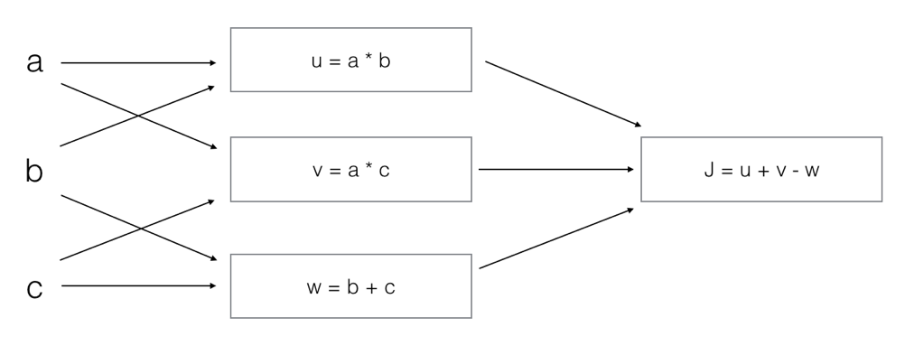

## Quiz 2: Neural Network Basics

1.  What does a neuron compute?
  *  A neuron computes an activation function followed by a linear function (z = Wx + b)

  *  **A neuron computes a linear function (z = Wx + b) followed by an activation function**

  *  A neuron computes a function g that scales the input x linearly (Wx + b)

  *  A neuron computes the mean of all features before applying the output to an activation function

2.  Which of these is the "Logistic Loss"?
  *  L(i)(y^(i),y(i))=∣y(i)−y^(i)∣

  *  L(i)(y^(i),y(i))=∣y(i)−y^(i)∣2

  *  **L(i)(y^(i),y(i))=−(y(i)log(y^(i))+(1−y(i))log(1−y^(i)))**

  *  L(i)(y^(i),y(i))=max(0,y(i)−y^(i))

3.  Suppose img is a (32,32,3) array, representing a 32x32 image with 3 color channels red, green and blue. How do you reshape this into a column vector?
  *  x = img.reshape((3,32*32))

  *  x = img.reshape((1,32*32,3))

  *  x = img.reshape((32*32,3))

  *  **x = img.reshape((32*32*3,1))**

4.  Consider the two following random arrays "a" and "b":

  ```
  a = np.random.randn(2, 3) # a.shape = (2, 3)
  b = np.random.randn(2, 1) # b.shape = (2, 1)
  c = a + b
  ```

  What will be the shape of "c"?
    *  c.shape = (2, 1)

    *  **c.shape = (2, 3)**

    *  The computation cannot happen because the sizes don't match. It's going to be "Error"!

    *  c.shape = (3, 2)

5.  Consider the two following random arrays "a" and "b":

  ```
  a = np.random.randn(4, 3) # a.shape = (4, 3)
  b = np.random.randn(3, 2) # b.shape = (3, 2)
  c = a*b
  ```

  What will be the shape of "c"?
    *  **The computation cannot happen because the sizes don't match. It's going to be "Error"!**

    *  c.shape = (4, 3)

    *  c.shape = (3, 3)

    *  c.shape = (4, 2)

6.  Suppose you have nx input features per example. Recall that X=[x(1)x(2)...x(m)]. What is the dimension of X?
  *  (m,1)

  *  **(nx,m)**

  *  (m,nx)

  *  (1,m)

7.  Recall that "np.dot(a,b)" performs a matrix multiplication on a and b, whereas "a*b" performs an element-wise multiplication.
Consider the two following random arrays "a" and "b":

  ```
  a = np.random.randn(12288, 150) # a.shape = (12288, 150)
  b = np.random.randn(150, 45) # b.shape = (150, 45)
  c = np.dot(a,b)
  ```

  What is the shape of c?
    *  **c.shape = (12288, 45)**

    *  The computation cannot happen because the sizes don't match. It's going to be "Error"!

    *  c.shape = (150,150)

    *  c.shape = (12288, 150)

8.  Consider the following code snippet:

  ```
  # a.shape = (3,4)
  # b.shape = (4,1)
  for i in range(3):
    for j in range(4):
      c[i][j] = a[i][j] + b[j]
  ```

  How do you vectorize this?
    *  c = a + b

    *  c = a.T + b

    *  c = a.T + b.T

    *  **c = a + b.T**

9.  Consider the following code:

  ```
  a = np.random.randn(3, 3)
  b = np.random.randn(3, 1)
  c = a*b
  ```

  What will be c? 
    *  **This will invoke broadcasting, so b is copied three times to become (3,3), and ∗is an element-wise product so c.shape will be (3, 3)**

    *  This will invoke broadcasting, so b is copied three times to become (3, 3), and ∗invokes a matrix multiplication operation of two 3x3 matrices so c.shape will be (3, 3)

    *  This will multiply a 3x3 matrix a with a 3x1 vector, thus resulting in a 3x1 vector. That is, c.shape = (3,1).

    *  It will lead to an error since you cannot use " * " to operate on these two matrices. You need to instead use np.dot(a,b)

10.  Consider the following computation graph.

  

  What is the output J?
    *  J = (c - 1)(b + a)

    *  **J = (a - 1)(b + c)**

    *  J = ab + bc + ac

    *  J = (b - 1)(c + a)
