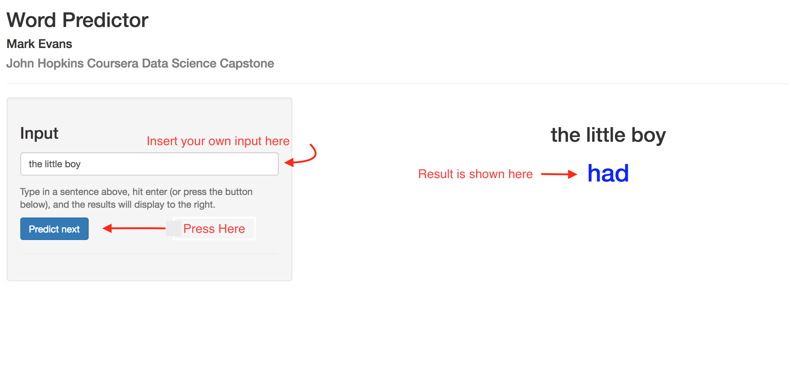

John Hopkins University Coursera Capstone Final Project
========================================================
author: Mark Evans
date: September 9th, 2017
autosize: true

Overview
========================================================

If you haven't tried out the app, go [here](https://meutband.shinyapps.io/ShinyApp/) to try it!
 
- Predicts the next word of a sentence/statement given.

Instructions
========================================================

Algorithm Used
========================================================

- N-gram model with "Stupid Backoff" ([Brants et al 2007](http://www.cs.columbia.edu/~smaskey/CS6998-0412/supportmaterial/langmodel_mapreduce.pdf))
- Checks if highest-order (n=4) n-gram has been seen. If not "degrades" to a lower-order model (n=3, 2),..., and so on.

About Me
========================================================

[LinkedIn](https://www.linkedin.com/in/markhevans/)

[Twitter](https://twitter.com/markhevans1)

[Github](http://github.com/meutband)

[RPubs](http://rpubs.com/meutband)

- Will get the project on github over the next couple of days.
